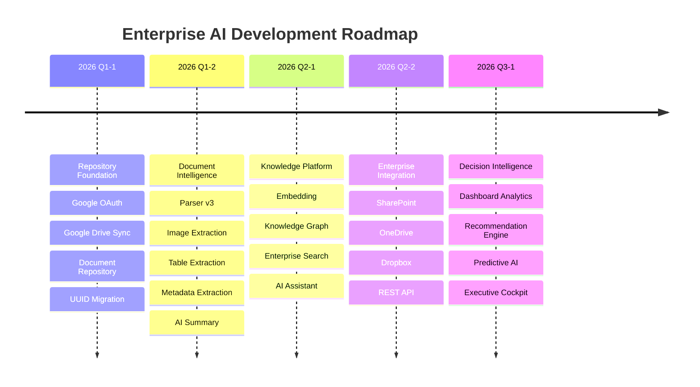

# 🚀 Enterprise AI Roadmap

## Vision

> **Enterprise AI Document Intelligence Platform**
>
> Transforming documents into organizational knowledge through AI, Retrieval-Augmented Generation (RAG), and Knowledge Graph.

---

# Development Timeline



---

# Current Progress

```text
Repository Engine        █████████░░   90%

Document Pipeline        ████████░░░   80%

Document Viewer          ██████░░░░░   60%

AI Analyzer              ██░░░░░░░░░   20%

Enterprise Search        ░░░░░░░░░░░    0%

Knowledge Graph          ░░░░░░░░░░░    0%

AI Assistant             ░░░░░░░░░░░    0%

Enterprise Analytics     ░░░░░░░░░░░    0%
```

---

# System Architecture

```text
Google Drive
Local Repository
SharePoint
OneDrive
Dropbox
        │
        ▼
 Repository Engine
        │
        ▼
 Document Pipeline
        │
 ┌──────┼──────────────┐
 │      │              │
 ▼      ▼              ▼
Text  Images        Tables
 │      │              │
 └──────┼──────────────┘
        ▼
 Document Intelligence
        │
        ▼
 AI Analyzer
        │
        ▼
 Knowledge Base
        │
        ▼
 Embedding
        │
        ▼
 Enterprise Search (RAG)
        │
        ▼
 Enterprise AI Assistant
        │
        ▼
 Decision Support Dashboard
```

---

# Milestone 1 ✅ Repository Foundation

Completed

* Google OAuth
* Recursive Folder Scanner
* Google Docs Import
* PDF Import
* DOCX Import
* UUID Migration
* Dashboard Repository
* Document Viewer (Basic)

---

# Milestone 2 🚧 Document Intelligence

In Progress

* DocumentPipeline v3
* Image Extraction
* Table Extraction
* Metadata Extraction
* Chunk Builder
* AI Summary
* Keyword Extraction
* Named Entity Recognition

Target Completion

Q3 2026

---

# Milestone 3 📚 Knowledge Platform

Planned

* Embedding
* Vector Search
* Knowledge Graph
* Semantic Search
* Similar Document
* Related Knowledge

Target

Q3 2026

---

# Milestone 4 🤖 Enterprise AI

Planned

Enterprise AI Chat

Capabilities

* Ask Documents
* Cross-document Search
* Company Knowledge
* SOP Assistant
* Policy Assistant
* Management Report

Powered by

* OpenAI
* RAG
* Knowledge Graph

---

# Milestone 5 🌐 Enterprise Integration

Future

Supported Repository

* Google Drive
* OneDrive
* SharePoint
* Dropbox
* FTP Repository
* Local Folder
* REST API

---

# Milestone 6 📊 Decision Intelligence

Future

Executive Dashboard

* AI Analytics
* Knowledge Growth
* Repository Health
* Organization Learning
* Recommendation Engine
* Predictive Analysis

---

# Future Vision (2027)

```text
Documents

↓

Knowledge

↓

Reasoning

↓

Recommendation

↓

Decision

↓

Organizational Intelligence
```

Enterprise AI is designed not only as a document repository, but as a comprehensive **Enterprise Knowledge & Decision Intelligence Platform** capable of supporting organizational learning, strategic planning, and AI-assisted decision making.

